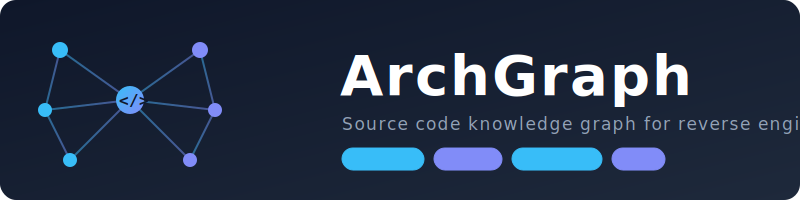

<p align="center">
  
</p>

<p align="center">
  <a href="LICENSE"></a>
  <a href="https://www.python.org/downloads/"></a>
  <a href="https://modelcontextprotocol.io"></a>
  
</p>

<p align="center">
  <b>Code intelligence for AI agents and security auditing.</b><br/>
  Parses <b>11 languages</b>, builds a knowledge graph with <b>compiler-backed call resolution</b>,<br/>
  <b>taint analysis</b>, <b>CVE detection</b>, and <b>clustering</b>. Expose to any agent via <b>MCP</b>.
</p>

---

## What Does It Do?

ArchGraph turns your source code into a **queryable knowledge graph** stored in Neo4j. It understands call relationships, data flows, security patterns, and git history -- then exposes all of this to AI agents via MCP.

```
Your Code  -->  ArchGraph  -->  Neo4j Graph  -->  AI Agent (via MCP)
                                                   Python API
                                                   Web Dashboard
                                                   CLI Queries
```

**Without ArchGraph**, your AI agent sees text files and guesses.
**With ArchGraph**, your agent sees call chains, taint paths, blast radius, and CVEs.

---

## Quick Start

### 1. Install

```bash
pip install archgraph
```

### 2. Start Neo4j

```bash
docker compose up -d neo4j
```

Or use an existing Neo4j 5+ instance. Default credentials: `neo4j` / `archgraph`.

### 3. Extract Your Repo

```bash
archgraph extract /path/to/your/repo
```

That's it. ArchGraph auto-detects languages, runs SCIP indexers for accurate call resolution, extracts git history, scans dependencies, and imports everything into Neo4j.

### 4. Use It

**With an AI agent (recommended):**
```bash
archgraph mcp                                          # Start MCP server
claude mcp add archgraph -- archgraph mcp              # Connect Claude Code
```

**From the command line:**
```bash
archgraph search -n "auth*" -t function                # Find functions
archgraph impact "func:src/auth.py:validate:42"        # Blast radius
archgraph query "MATCH (f:Function) RETURN f.name"     # Raw Cypher
```

**From Python:**
```python
from archgraph import ArchGraph

ag = ArchGraph()
ag.search(name="validate*", type="function")
ag.impact("func:src/auth.py:validate:42", direction="both")
ag.context("func:src/api.py:handle_request:10")
ag.close()
```

**Web dashboard:**
```bash
archgraph serve --port 8080                            # Opens at localhost:8080
```

---

## Supported Languages

| Language | Call Resolution | Auto-Install | You Need |
|----------|----------------|-------------|----------|
| TypeScript | SCIP (compiler-backed) | scip-typescript | Node.js |
| JavaScript | SCIP (compiler-backed) | scip-typescript | Node.js |
| Python | SCIP (compiler-backed) | scip-python | Node.js |
| Rust | SCIP (compiler-backed) | rust-analyzer | Rust toolchain |
| Go | SCIP (compiler-backed) | scip-go | Go toolchain |
| Java | SCIP (compiler-backed) | scip-java | JDK |
| Kotlin | SCIP (compiler-backed) | scip-java | JDK + `pip install archgraph[kotlin]` |
| C | Heuristic (name-based) | -- | `pip install archgraph[clang]` for deep analysis |
| C++ | Heuristic (name-based) | -- | `pip install archgraph[clang]` for deep analysis |
| Swift | Heuristic (name-based) | -- | `pip install archgraph[swift]` |
| Objective-C | Heuristic (name-based) | -- | `pip install archgraph[objc]` |

**SCIP vs Heuristic:** SCIP runs the language's own compiler to resolve calls with full type information -- it knows *exactly* which function is being called. Heuristic matches by name and can pick the wrong target in projects with common names like `process()`, `get()`, or `toString()`. SCIP indexers are downloaded automatically on first use; you just need the language toolchain installed.

**Install everything at once:**
```bash
pip install archgraph[all]
```

---

## AI Agent Integration (MCP)

ArchGraph is designed to be used through AI agents. It provides **12 tools** and **4 resources** via MCP.

### Connect Your Agent

| Agent | Setup |
|-------|-------|
| **Claude Code** | `claude mcp add archgraph -- archgraph mcp` |
| **Cursor** | Add to `~/.cursor/mcp.json` |
| **Windsurf** | Add to MCP settings |
| **Any MCP client** | `archgraph mcp` (stdio transport) |

### Available Tools

| Tool | What It Does |
|------|-------------|
| `query` / `cypher` | Run Cypher queries against the graph |
| `search` | Find symbols by name, type, or file pattern |
| `search_calls` | Find call chains between functions (with source filtering) |
| `context` | 360-degree view of a symbol -- callers, callees, cluster, security labels |
| `impact` | Blast radius analysis -- what depends on this function? |
| `detect_changes` | Which clusters, processes, and security paths are affected by file changes? |
| `find_vulnerabilities` | Find CVEs in dependencies |
| `source` | Get the source code of any function or class |
| `extract` | Index a new repository (supports git URLs) |
| `stats` | Graph statistics -- node/edge counts |
| `repos` | List all indexed repositories |

### Call Resolution Confidence

Every CALLS edge has a `source` property so your agent knows how reliable it is:

| Source | Confidence | How |
|--------|-----------|-----|
| `scip` | High | Compiler-backed cross-references |
| `heuristic` | Lower | Name-based matching (4-level fallback) |

Use `search_calls(source="scip")` to only get compiler-verified call chains, or check `resolution_confidence` in impact analysis results.

### Example Conversation

```
You: "What's the security impact of changing the parse_request function?"

Agent uses impact() -> sees 12 downstream functions, 3 reach dangerous sinks
Agent uses context() -> sees parse_request is an input source
Agent uses search_calls(source="scip") -> traces verified call chain

Agent: "parse_request() is an input source that reaches dangerous sinks
        through 3 hops (all SCIP-verified). Changing it could affect
        12 functions across 4 files. Resolution confidence: high.
        Risk level: HIGH."
```

---

## Security Features

### Automatic Labels

Every function is automatically tagged:

| Label | Meaning | Examples |
|-------|---------|---------|
| `is_input_source` | Reads external data | recv, read, fetch, getParameter, stdin |
| `is_dangerous_sink` | Unsafe operations | memcpy, exec, eval, innerHTML, system |
| `is_allocator` | Memory management | malloc, free, new, Box::new, make |
| `is_crypto` | Cryptographic ops | encrypt, SHA256, HMAC, AES |
| `is_parser` | Parsing / deserialization | JSON.parse, unmarshal, deserialize |

### Taint Tracking

With deep analysis enabled, ArchGraph traces data from input sources to dangerous sinks:

```bash
archgraph extract /path/to/repo --include-clang     # C/C++ taint via libclang
archgraph extract /path/to/repo --include-deep       # Rust/Java/Go taint via tree-sitter
```

### CVE Detection

```bash
archgraph extract /path/to/repo --include-cve
```

Automatically queries the [OSV database](https://osv.dev) for known vulnerabilities in your dependencies. Supports npm, PyPI, crates.io, Go, Maven, CocoaPods, and more.

### Security Report

```bash
archgraph report /path/to/repo -o report.html
```

Generates a single-file HTML report with risk scores, taint paths, CVEs, and more.

---

## All CLI Commands

| Command | Description |
|---------|-------------|
| `archgraph extract <path>` | Extract code graph (local path or git URL) |
| `archgraph search` | Search symbols by name/type/file |
| `archgraph query <cypher>` | Run Cypher queries |
| `archgraph impact <symbol>` | Blast radius analysis |
| `archgraph stats` | Graph statistics |
| `archgraph schema` | Show graph schema |
| `archgraph diff <path>` | Compare repo vs stored graph |
| `archgraph export <path>` | Export to JSON, GraphML, or CSV |
| `archgraph report <path>` | Generate HTML security report |
| `archgraph serve` | Start web dashboard |
| `archgraph mcp` | Start MCP server |
| `archgraph skills <path>` | Generate AI agent skill files |
| `archgraph repos` | List indexed repositories |

See [CLI Reference](docs/CLI.md) for all options.

---

## Python API

```python
from archgraph import ArchGraph

ag = ArchGraph()  # connects to Neo4j with defaults

# Extract a repo (works with local paths and git URLs)
result = ag.extract("https://github.com/user/repo", languages=["python"])

# Search
ag.search(name="handle_*", type="function", limit=10)

# Call chains (filter by confidence)
ag.search_calls(caller="parse", target="exec", source="scip")

# Impact analysis (includes resolution confidence)
ag.impact("func:src/api.py:handler:42", direction="both", max_depth=5)

# 360-degree context (callers/callees with resolution source)
ag.context("func:src/auth.py:validate:10")

# Security
ag.find_vulnerabilities(severity="CRITICAL")
ag.detect_changes(["src/auth.py", "src/api.py"])

# Source code
ag.source("func:src/main.py:main:1")

# Raw Cypher
ag.query("MATCH (f:Function {is_input_source: true}) RETURN f.name, f.file")

ag.close()
```

---

## Extract Options

```bash
# Basic extraction (auto-detect languages)
archgraph extract /path/to/repo

# From a GitHub URL
archgraph extract https://github.com/user/repo

# Specify languages and parallelism
archgraph extract /path/to/repo -l python,typescript -w 4

# Full security analysis
archgraph extract /path/to/repo --include-cve --include-clang --include-deep

# With clustering and process tracing
archgraph extract /path/to/repo --include-clustering --include-process

# Incremental extraction (only changed files)
archgraph extract /path/to/repo --incremental

# Clear database before import
archgraph extract /path/to/repo --clear-db
```

---

## Benchmarks

| Project | Language | Files | Nodes | Edges | SCIP CALLS | Time |
|---------|----------|-------|-------|-------|------------|------|
| [zod](https://github.com/colinhacks/zod) | TypeScript | 389 | 6,921 | 12,254 | 4,768 | 63s |
| [schedule](https://github.com/dbader/schedule) | Python | 4 | 660 | 2,174 | 537 | 39s |
| [memchr](https://github.com/BurntSushi/memchr) | Rust | 64 | 7,776 | 8,490 | 259 | 53s |
| [xxhash](https://github.com/cespare/xxhash) | Go | 12 | 275 | 617 | 71 | 11s |
| [gson](https://github.com/google/gson) | Java | 259 | 11,631 | 35,505 | heuristic | 71s |

*Windows 11, Python 3.13, 8 workers. Includes git history, dependencies, and SCIP indexing.*

---

## Configuration

### Neo4j Connection

Set via CLI options or environment variables:

```bash
export ARCHGRAPH_NEO4J_URI=bolt://localhost:7687
export ARCHGRAPH_NEO4J_USER=neo4j
export ARCHGRAPH_NEO4J_PASSWORD=archgraph
export ARCHGRAPH_NEO4J_DATABASE=neo4j
```

### Docker Compose

```bash
docker compose up -d       # Starts Neo4j
docker compose down        # Stops Neo4j
```

---

## Documentation

| Document | Description |
|----------|-------------|
| [CLI Reference](docs/CLI.md) | All commands, options, and examples |
| [Architecture & Schema](docs/ARCHITECTURE.md) | Graph schema, node/edge types, pipeline details |
| [AI Agent Integration](docs/AGENT.md) | MCP setup, Python API, rlm-agent tool |
| [Security Analysis](docs/SECURITY.md) | Security labels, taint tracking, CVE detection |
| [Deep Analysis](docs/DEEP_ANALYSIS.md) | CFG, data flow, language-specific patterns |
| [Roadmap](docs/ROADMAP.md) | Development phases and comparison with alternatives |

---

## Development

```bash
git clone https://github.com/Deaxu/ArchGraph.git
cd ArchGraph
pip install -e ".[dev,all]"
pytest tests/ -v               # 212 passed, 22 skipped
```

Tests run without Neo4j -- they use temporary directories with real tree-sitter parsing and git operations.

---

## License

[MIT](LICENSE)
